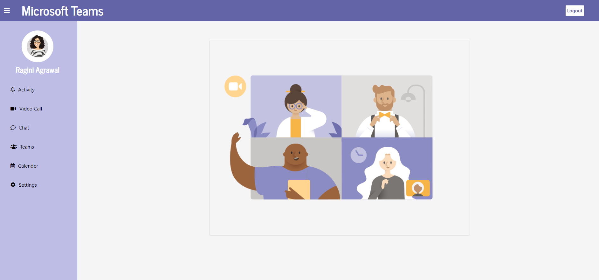
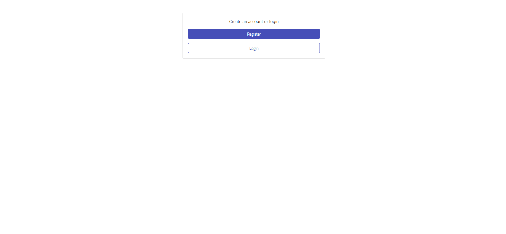
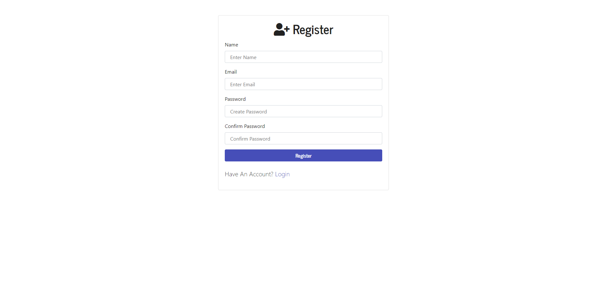
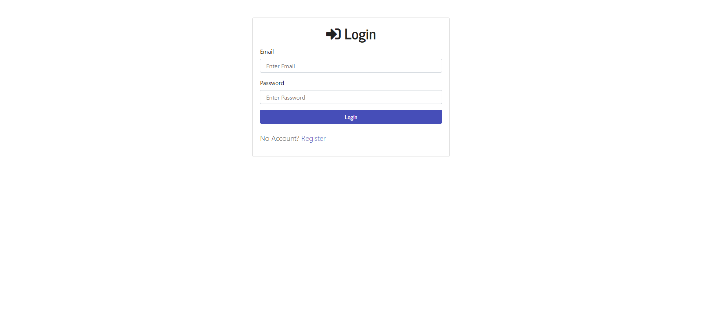
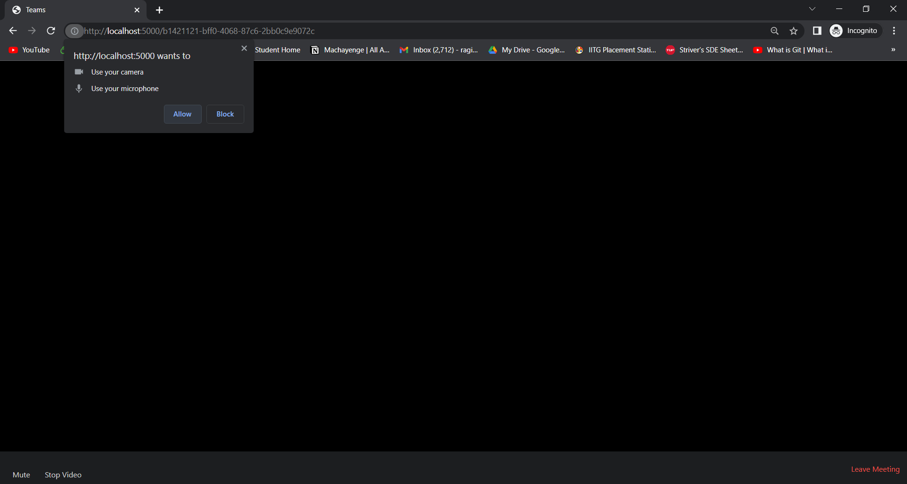
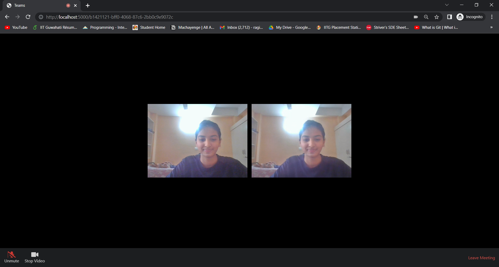

# Microsoft Teams Clone
  

## Microsoft Engage-2021
* The Challenge
	* Build a Microsoft Teams clone
	* Your solution should be a fully functional prototype with at least one mandatory functionality - a minimum of two participants should be able connect with each other using your product to have a video conversation.
	* Adapt Feature: Include a chat feature in your application where meeting participants can share info without disrupting the flow of the meeting

<!-- # How to run?
  - pip install -r requirements.txt
  - cd into project dir
  - python manage.py runserver
  - python manage.py run_chat_server in another window -->

## Technology Stack

      

        <code></code>
        <code></code>
        <code></code>
        <code></code>
        <code></code>
      

- Frontend is implemented using HTML and CSS.
- Backend of the projecT is implemented using Node JS.
- MongoDB is used as a NoSQL database.
- WebRTC and Socket.IO are used for real-time communication.
- Git is used for version control.

## Main Features 
* Register/Login with Email and Password
  * Authentication is done using passport, the authentication middleware for Node.js
  * Password is encrypted using bcrypt
  * The user credentials are stored in MongoDB database after the user registers
* Group Video Calling
  * The group video call is implemented using Agora Web SDK NG.
  * Agora Web SDK NG enables audio and video real-time communications.
  * It has a Selective Forwarding Unit(SFU) Architecture.
  * All clients connected on a particular channel publish their audio and video tracks to the server.
  * The server is then broadcasting the received tracks to the other participants present in the call.

* Audio/Video Mute/Unmute
  * This is done by unpublishing user's audio/video stream to the server.
  * The server relays this information to all other clients.

## Gallery
  
  
  
  
  
  

